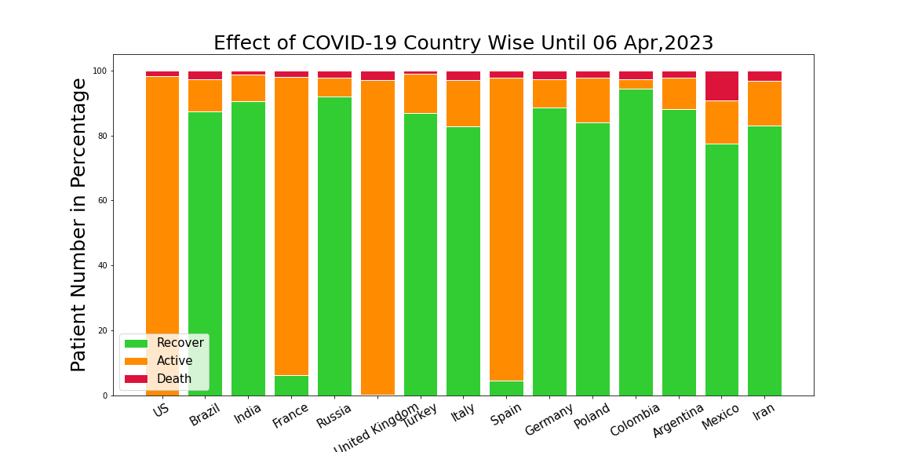

# Data visulization in Python3 #

## Description: ##

Coronavirus rapidly spread out across the world.This is the visual representation of affected,recovered & death people in numbers.In this visulization data was represented by country & worldwide wise.

## Data collection ##

This data was collected from an online portal in real time. [Link](https://data.humdata.org/dataset/novel-coronavirus-2019-ncov-cases)

## Data visualize ##
* **Word Cloud:**
  
* **Country Wise Comparisions:**
  
* **Country Statistics Graph:**
  
* **Country Statistics:**
  
* **Worldwide Affected Statistics:**
  

## Country included in this Dataset:
- List available in the Plotly [README.md](../Plotly/README.md) file