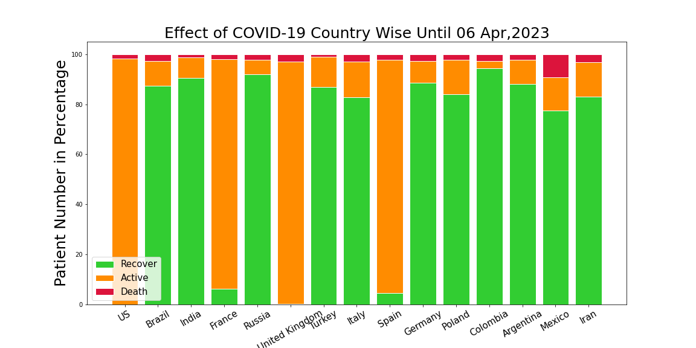

# COVID-19 Data Visualization with Matplotlib

A Python-based data visualization project that analyzes and visualizes global COVID-19 statistics using Matplotlib. The project processes time-series data for confirmed cases, recoveries, and deaths across 190+ countries, producing word clouds, stacked bar charts, comparative line graphs, and per-country trend analyses.

---

## Features

- **Word Cloud** -- Generates a word cloud weighted by active case counts, giving an immediate visual sense of which countries carry the largest burden.
- **Stacked Bar Charts** -- Displays recovery, active, and death proportions per country as percentage-based stacked bars.
- **Worldwide Distribution Bars** -- Shows each country's share of global recoveries, active cases, or deaths.
- **Multi-Country Comparison Graphs** -- Plots time-series curves for selected countries on the same axes, with configurable case thresholds.
- **Single-Country Trend Lines** -- Charts confirmed, recovered, and death curves over time for any individual country.

---

## Sample Visualizations

**Active Cases Word Cloud**


**Country-Wise Case Breakdown (Stacked Bar)**



**Multi-Country Death Case Comparison**


**US COVID-19 Trend Graph**


---

## Tech Stack

| Library | Purpose |
|---|---|
| **Python 3** | Core language |
| **Pandas** | Data loading, cleaning, and aggregation |
| **Matplotlib** | All charts and plots |
| **WordCloud** | Word cloud generation |

---

## Data Sources

Time-series CSV data sourced from the [Johns Hopkins CSSE COVID-19 Dataset](https://github.com/CSSEGISandData/COVID-19), accessed through the [Humanitarian Data Exchange (HDX)](https://data.humdata.org/dataset/novel-coronavirus-2019-ncov-cases).

The dataset includes daily cumulative counts of confirmed cases, recoveries, and deaths by country from January 2020 onward. Local CSV snapshots are stored in the `data/` directory for offline use.

---

## How to Run

1. **Install dependencies**

   ```bash
   pip install pandas matplotlib wordcloud
   ```

2. **Launch Jupyter**

   ```bash
   cd CoronaAffectedCountry/MatPlot
   jupyter notebook
   ```

3. **Run the notebooks**

   - Open `Bar.ipynb` for word clouds and bar chart visualizations.
   - Open `Graph.ipynb` for time-series line graphs and country comparisons.

4. **Refresh data from the live source** (optional)

   Pass `online=True` when instantiating the classes to download the latest CSV data:

   ```python
   bar = CovidBar(online=True)
   graph = CovidGraph(online=True)
   ```

---

## Project Structure

```
MatPlot/
├── Bar.ipynb                  # Word clouds, stacked bars, worldwide distribution charts
├── Graph.ipynb                # Time-series line graphs and multi-country comparisons
├── README.md
├── data/
│   ├── Confirmed.csv          # Daily confirmed cases by country
│   ├── Recovered.csv          # Daily recovered cases by country
│   ├── Death.csv              # Daily death cases by country
│   └── Stat_updated.csv       # Computed aggregate statistics
├── images/                    # Saved chart outputs (PNG)
└── utils/
    ├── graph_data_extract.py  # Loads and groups time-series CSVs for line graphs
    └── stat_data_extract.py   # Computes per-country and worldwide percentages for bar charts
```
