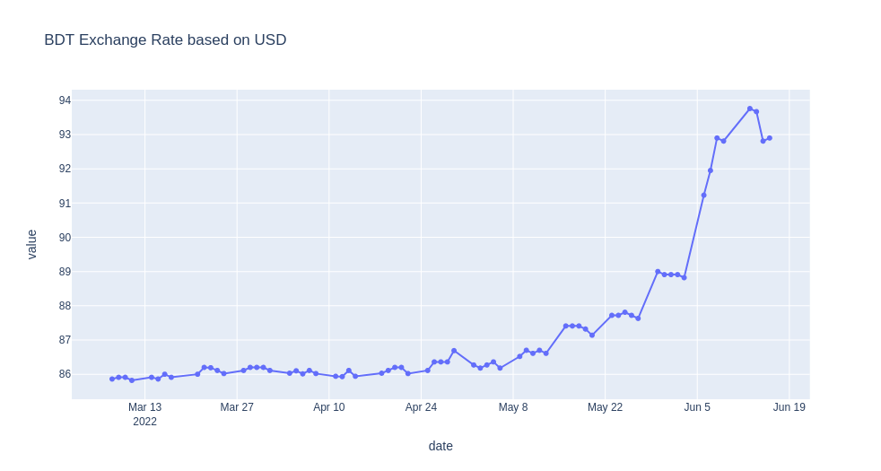

# BDT Exchange Rate based on USD using Plotly #

## Description: ##

I have scrap historical data for specific currency exchange rate & plot those data.

## Data collection ##

This data was collected from an online portal in real time. [Link](https://www.investing.com/currencies/usd-bdt-historical-data)


## Program ##

  ``` country_curr   = Country currency name``` [Example can be found in [country_currency_code.json](country_currency_code.json)] 
  
  ``` days = For how many days in the past historical data you need ```
  ``` 
    Example:
      country_curr = BDT
      days = 100
      BDT exchange rate based on USD 100 days historical data
  ```
  
