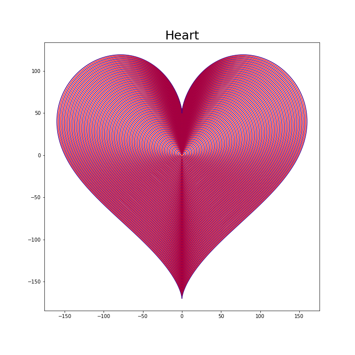

# Matplot Library in Python3 #

## Description: ##

**matplotlib** module used for plotting different types of shape in 2D & 3D.

## Program ##

* In this program different types of shapes were created :
  
  
  
