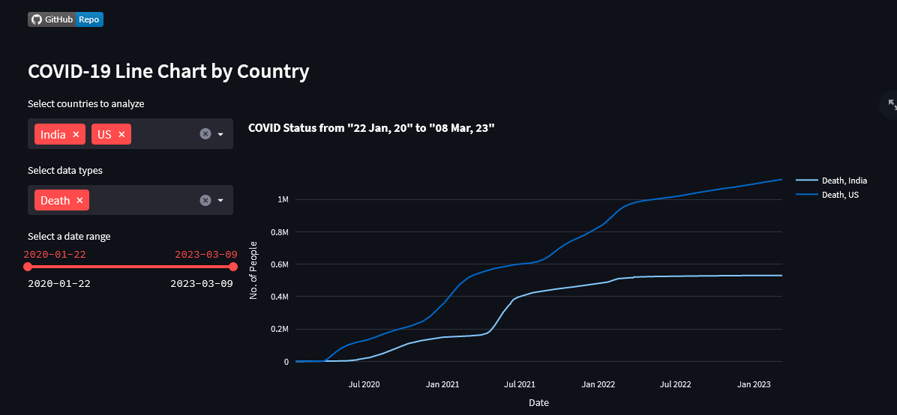
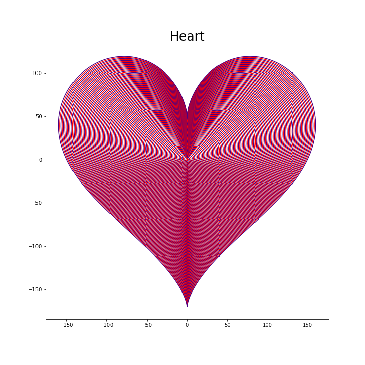
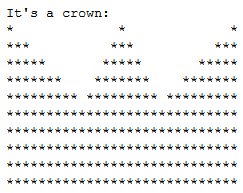

# Python Data Visualization #
## **Corona Affected Country [Link](CoronaAffectedCountry)**

## Streamlit App [ Link ](Streamlit)
- Covid App [ Link ](Streamlit/covid/)

- Call Log Analysis [ Link ](Streamlit/Call%20Log%20Analysis/)

## **SSC Scholarship 2023 [ Link ](SSCScholarship)**

## **Kuet Student Gender Ratio(Web Scrapping) [ Link ](Kuet%20Student%20Gender%20Ratio)**
.png)
  
## **Matplot 2D & 3D [ Link ](Matplot2D3D)**

  
  * There is also:
      * 3D Normal distribution shape
      * Prime number shape
      * Random sine shape
## **Progress Bar [ Link ](ProgressBar)**
  ```
  Example:
  value, maximum = 40 200
  40 out of 200 after rescaling in percentage:
  output = 
  ```
  

## **Geometric Shape [ Link ](GeometricShape)**
  ``` 
    Example for crown:
    n=5 
  ```
  
    
   * This problem is solved for:
      * Triangle
      * Right triangle
      * Square
      * Rectangle
      * Crown

