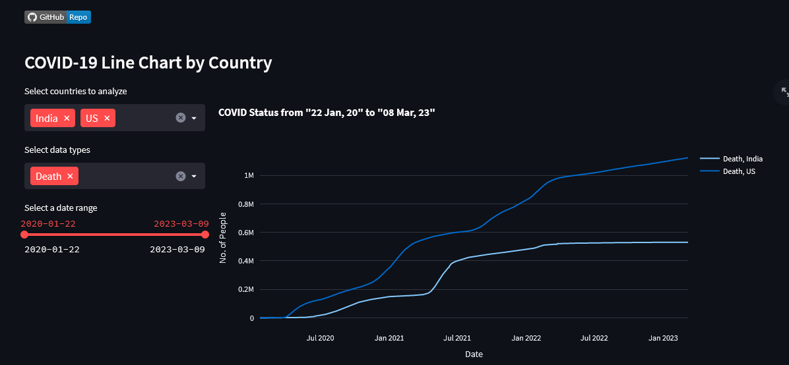
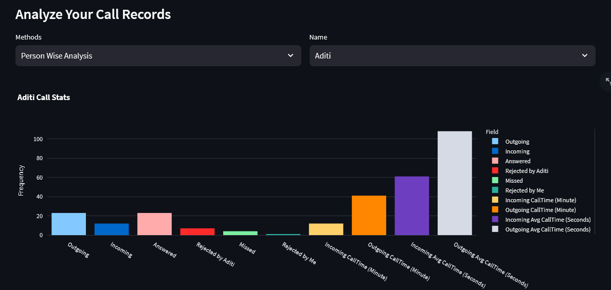
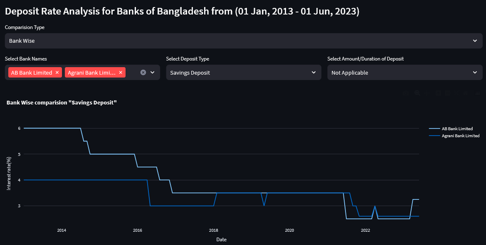
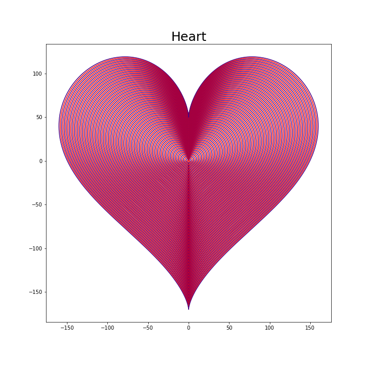
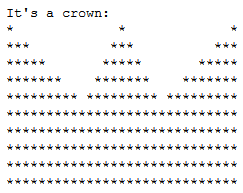

<div align="center">

# Python Data Visualization

**A collection of data visualization projects built with Python -- from interactive Streamlit dashboards to Jupyter notebook explorations.**

[](https://www.python.org/)
[](https://jupyter.org/)
[](https://streamlit.io/)
[](LICENSE)

[View on GitHub Pages](https://mazhar004.github.io/python-data-visualization/)

</div>

---

## Table of Contents

- [Overview](#overview)
- [Project Structure](#project-structure)
- [Streamlit Web Apps](#streamlit-web-apps)
  - [COVID-19 Data Analysis](#covid-19-data-analysis)
  - [Call Log Analysis](#call-log-analysis)
  - [Bangladesh Bank Deposit Rates](#bangladesh-bank-deposit-rates)
- [Notebook Projects](#notebook-projects)
  - [Corona Affected Country (Plotly)](#corona-affected-country-plotly)
  - [Corona Affected Country (Matplotlib)](#corona-affected-country-matplotlib)
  - [SSC Scholarship 2022](#ssc-scholarship-2022)
  - [KUET Student Gender Ratio](#kuet-student-gender-ratio)
  - [Matplotlib 2D and 3D Plots](#matplotlib-2d-and-3d-plots)
  - [Geometric Shapes](#geometric-shapes)
  - [Progress Bar](#progress-bar)
- [Tech Stack](#tech-stack)
- [Getting Started](#getting-started)
- [License](#license)
- [Links](#links)

---

## Overview

This repository is a growing collection of Python-based data visualization projects. It covers a range of techniques -- from static charts in Matplotlib to interactive plots in Plotly and full web dashboards built with Streamlit. Each sub-project lives in its own directory with dedicated data, notebooks, and output images.

The projects span real-world datasets (COVID-19 statistics, bank interest rates, scholarship results) as well as mathematical and algorithmic visualizations (geometric shapes, prime number patterns, 3D surfaces).

---

## Project Structure

```
python-data-visualization/
|
|-- CoronaAffectedCountry/
|   |-- MatPlot/             # COVID-19 analysis using Matplotlib
|   +-- Plotly/              # COVID-19 analysis using Plotly
|
|-- Streamlit/
|   |-- CovidDataAnalysis/   # Streamlit dashboard for COVID-19 data
|   |-- CallLogAnalysis/     # Streamlit dashboard for call log insights
|   +-- BangladeshBankDeposit/ # Streamlit dashboard for bank deposit rates
|
|-- SSCScholarship/          # SSC 2022 scholarship PDF extraction and viz
|-- KuetStudentGenderRatio/  # Web-scraped gender ratio analysis (KUET)
|-- Matplot2D3D/             # 2D and 3D mathematical plots
|-- GeometricShape/          # CLI and graphical geometric shapes
+-- ProgressBar/             # Terminal progress bar utility
```

---

## Streamlit Web Apps

Three interactive dashboards deployed on Streamlit Cloud.

### COVID-19 Data Analysis

[](https://visualcovid.streamlit.app/)


Visual representation of COVID-19 confirmed, recovered, and death cases -- filterable by country with line and bar chart views. Data sourced from the [Humanitarian Data Exchange](https://data.humdata.org/dataset/novel-coronavirus-2019-ncov-cases).



> [Project folder](Streamlit/CovidDataAnalysis/) -- [Live demo](https://visualcovid.streamlit.app/)

---

### Call Log Analysis

[](https://calllog.streamlit.app/)


Analyzes call logs to uncover communication patterns: call frequency, duration, missed calls, rejected calls, and hourly call schedules. Supports both aggregate and per-person breakdowns. Uses artificially generated sample data.



> [Project folder](Streamlit/CallLogAnalysis/) -- [Live demo](https://calllog.streamlit.app/)

---

### Bangladesh Bank Deposit Rates

[](https://bdbankanalysis.streamlit.app/)


Interest rate comparison across scheduled banks in Bangladesh. Provides bank-wise and deposit-scheme-wise visual comparisons. Data sourced from [Bangladesh Bank](https://www.bb.org.bd/en/index.php/financialactivity/interestdeposit).



> [Project folder](Streamlit/BangladeshBankDeposit/) -- [Live demo](https://bdbankanalysis.streamlit.app/)

---

## Notebook Projects

Standalone Jupyter notebook explorations covering diverse datasets and techniques.

### Corona Affected Country (Plotly)


Interactive COVID-19 visualizations using Plotly -- word clouds, country comparisons, per-country statistics, and top-10 rankings. Covers 185 countries with real-time data.


> [Project folder](CoronaAffectedCountry/Plotly/)

---

### Corona Affected Country (Matplotlib)


The same COVID-19 dataset visualized with Matplotlib -- bar charts, line graphs, word clouds, and worldwide statistics.


> [Project folder](CoronaAffectedCountry/MatPlot/)

---

### SSC Scholarship 2022


Extracts scholarship data from a publicly available PDF (Dinajpur Education Board), cleans and structures it into a DataFrame, then visualizes results using Plotly with various grouping strategies.


> [Project folder](SSCScholarship/)

---

### KUET Student Gender Ratio


Scrapes real-time student enrollment data from the KUET official portal and visualizes department-wise gender ratios.


> [Project folder](KuetStudentGenderRatio/)

---

### Matplotlib 2D and 3D Plots


Mathematical art with Matplotlib: heart curves, 3D normal distribution surfaces, prime number spiral patterns, and random sine compositions.



> [Project folder](Matplot2D3D/)

---

### Geometric Shapes


Generates geometric shapes both as terminal text output (triangle, right triangle, square, rectangle, crown) and as graphical plots (rectangle, circle). The input parameter `n` controls the number of lines or size.



> [Project folder](GeometricShape/)

---

### Progress Bar


A simple terminal progress bar function. Takes a `value` and `maximum`, rescales to percentage, and prints a visual bar to the console.


> [Project folder](ProgressBar/)

---

## Tech Stack

| Category | Technologies |
|---|---|
| **Language** | Python 3.8+ |
| **Visualization** | Matplotlib, Plotly, WordCloud |
| **Web Framework** | Streamlit |
| **Data Processing** | Pandas, NumPy |
| **Web Scraping** | lxml, Requests |
| **PDF Processing** | PDF extraction (tabula / custom) |
| **Notebooks** | Jupyter Notebook |
| **Containerization** | Docker, Docker Compose |
| **Deployment** | Streamlit Cloud, GitHub Pages |

---

## Getting Started

### Prerequisites

- Python 3.8 or higher
- pip

### Clone the repository

```bash
git clone https://github.com/Mazhar004/python-data-visualization.git
cd python-data-visualization
```

### Option 1: Docker (Recommended)

Run all projects at once using Docker:

```bash
# Build and start all services
make up-build

# Or using docker-compose directly
docker compose up -d --build
```

| Service | URL | Description |
|---|---|---|
| Call Log Analysis | [localhost:8501](http://localhost:8501) | Call log dashboard |
| COVID-19 Analysis | [localhost:8502](http://localhost:8502) | COVID-19 dashboard |
| Bank Deposit Analysis | [localhost:8503](http://localhost:8503) | Bank deposit rates |
| Jupyter Notebooks | [localhost:8888](http://localhost:8888) | All notebooks |

```bash
# Stop all services
make down

# View logs
make logs

# Check service health
make status
```

### Option 2: Run individually

Each Streamlit app has its own `requirements.txt`. For example, to run the Call Log Analysis dashboard:

```bash
cd Streamlit/CallLogAnalysis
pip install -r requirements.txt
streamlit run app.py
```

### Option 3: Jupyter notebooks

```bash
pip install -r requirements.txt
jupyter notebook
```

Then navigate to any `.ipynb` file in the project directories.

---

## License

This project is open source. See the repository for license details.

---

## Links

| Resource | URL |
|---|---|
| GitHub Repository | [github.com/Mazhar004/python-data-visualization](https://github.com/Mazhar004/python-data-visualization) |
| GitHub Pages | [mazhar004.github.io/python-data-visualization](https://mazhar004.github.io/python-data-visualization/) |
| COVID-19 Dashboard | [visualcovid.streamlit.app](https://visualcovid.streamlit.app/) |
| Call Log Dashboard | [calllog.streamlit.app](https://calllog.streamlit.app/) |
| Bank Analysis Dashboard | [bdbankanalysis.streamlit.app](https://bdbankanalysis.streamlit.app/) |
