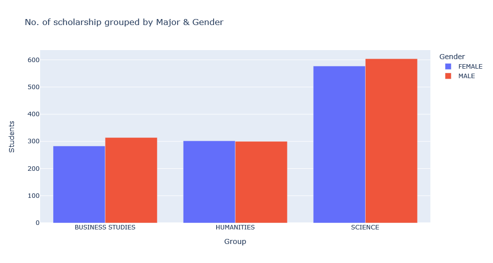

# SSC Scholarship PDF Process and Visualize #

## Description: ##

Publicly available SSC 2022 Scholarship, PDF data extract & visualize:
- [Data Source](http://www.dinajpureducationboard.gov.bd/site/view/commondoc/Scholarship%20Result/%E0%A6%AC%E0%A7%83%E0%A6%A4%E0%A7%8D%E0%A6%A4%E0%A6%BF%E0%A6%B0-%E0%A6%AB%E0%A6%B2%E0%A6%BE%E0%A6%AB%E0%A6%B2) 
- Extract data from the PDF
  - Read PDF
  - Clean Raw Data (Clean, Formatting, Filter & Drop Data)
  - Build a DataFrame
- Visualize the data
  - Using Plotly
  - Grouped the data in various way to generate different types of insight

Example Visualization:

