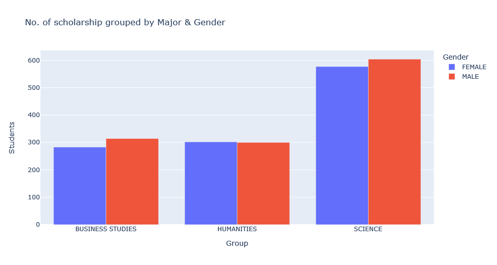

# SSC Scholarship PDF Processing and Visualization

A data pipeline that extracts scholarship data from a publicly available SSC 2022 scholarship PDF, cleans and structures it into a DataFrame, and generates interactive visualizations grouped by gender, academic major, and school.

## Features

- **PDF extraction** -- reads raw text from a multi-page scholarship results PDF using PyPDF2
- **Data cleaning** -- parses unstructured text with regex, handles inconsistent row lengths, drops malformed records, and normalizes formatting
- **Structured output** -- builds a clean pandas DataFrame with columns for merit position, roll number, name, school, group (major), and gender
- **Interactive visualizations** using Plotly:
  - Scholarship count grouped by gender
  - Scholarship count grouped by academic major (Science, Humanities, etc.)
  - Scholarship count grouped by major and gender
  - Top schools by total scholarships
  - Top schools by male and female scholarships separately
  - Gender ratio comparison across top schools
  - Top 200 merit students broken down by major and gender

## Sample Output

**Total Scholarship Statistics**



**Top 200 Students Statistics**


## Tech Stack

- **Python 3**
- **PyPDF2** -- PDF text extraction
- **pandas** -- data cleaning, transformation, and aggregation
- **re** (standard library) -- regex-based text parsing
- **Plotly Express** -- interactive bar chart visualizations

## How to Run

1. Install dependencies:

   ```bash
   pip install PyPDF2 pandas plotly
   ```

2. Open the notebook:

   ```bash
   jupyter notebook "SSC Scholarship PDF Process and Visualize.ipynb"
   ```

3. Run all cells. The notebook reads the PDF from `data/ssc-briti-din.pdf`, processes it, and generates the visualizations inline.

## Project Structure

```
SSCScholarship/
  SSC Scholarship PDF Process and Visualize.ipynb   # Main notebook
  README.md
  data/
    ssc-briti-din.pdf                               # Source PDF (scholarship results)
  images/
    total.png                                       # Total scholarship stats chart
    top 200.png                                     # Top 200 students stats chart
```

## Data Source

Scholarship data is publicly available from the [Dinajpur Education Board](http://www.dinajpureducationboard.gov.bd/).
