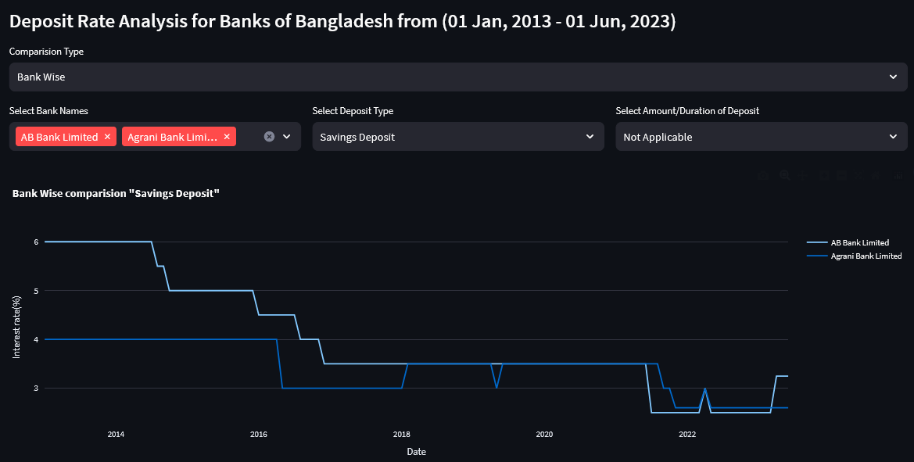
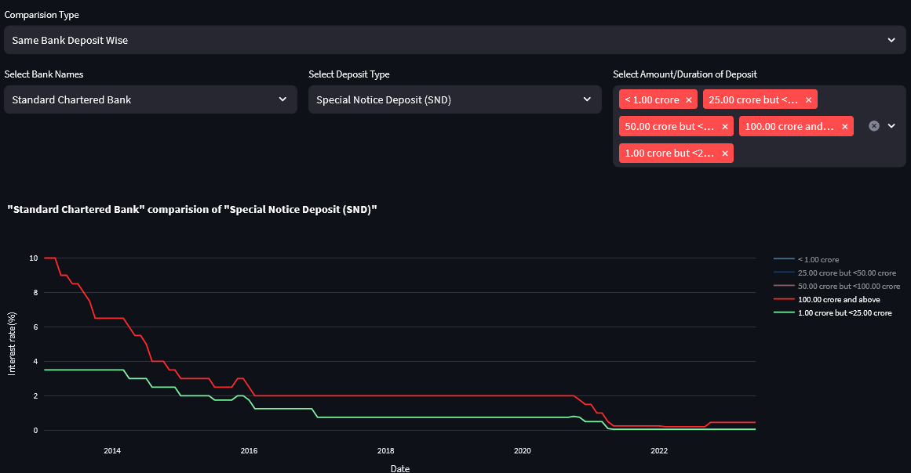

# Interest Rate Analysis for different Banks of Bangladesh using Streamlit #

## Description: ##

This is the **interest rate chart of the scheduled banks (deposit rate)(percentage per annum)** available publicly in Bangladesh Bank website. My aim to provide a visual comparision between different bank and their deposit scheme rate.
- [ Streamlit Web View ](https://bdbankanalysis.streamlit.app/)

Following ideas have been tried out so far:
- **Bank Wise Analysis** same scheme with different bank
- **Deposit wise Analysis** same bank with different scheme

## Installation

### Python Version
- Python == 3.8

### Library Installation
- Library Install
  - `pip install -r requirements.txt`

### Streamlit App Run(Web View)
- `streamlit run app.py`

## Data collection ##

This data was collected from an online portal & formatted locally. [Bangladesh Bank](https://www.bb.org.bd/en/index.php/financialactivity/interestdeposit)

## Data visualize ##
* **Bank Wise Comparisions:**
  
* **Deposit Wise Comparisions:**
  

