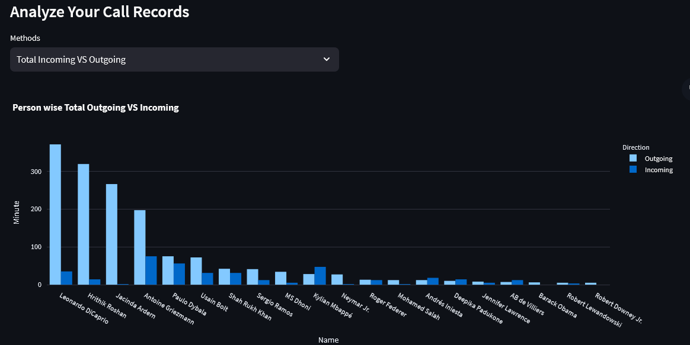
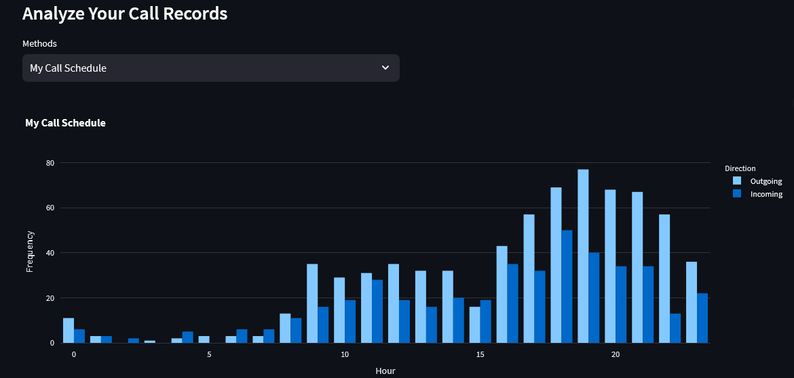

# Call Log Data visulization using Streamlit #

## Description: ##

**Call Log Analysis** aims to provide various methodologies and approaches to analyze call logs, extracting hidden insights and enhancing our understanding of communication patterns.
- [ Streamlit Web View  ](https://calllog.streamlit.app/)

Following ideas have been tried out so far:
- **Total number of calls** with each person (Incoming vs Outgoing)
- **Sum** of total duration of calls with each person (Incoming vs Outgoing)
- **Average** of total duration of calls with each person (Incoming vs Outgoing)
- Sort by total number of **Missed** call from each person
- Sort by total number of **Calls Rejected by Me**
- Sort by total number of **My Calls Rejected by Others**
- **My call schedule**
  - Group calls hourly basis
  - Represent in which hour of the day most calls are happening (Incoming vs Outgoing)
- Above mentioned all methods Person specific analyzing

## Installation

### Python Version
- Python == 3.8

### Library Installation
- Library Install
  - `pip install -r requirements.txt`

### Streamlit App Run(Web View)
- `streamlit run app.py`

## Data collection ##

This data was artificially generated by me.

## Data visualize ##
* **Total Calls Incoming vs Outgoing:**
  
* **My Call Hours:**
  

