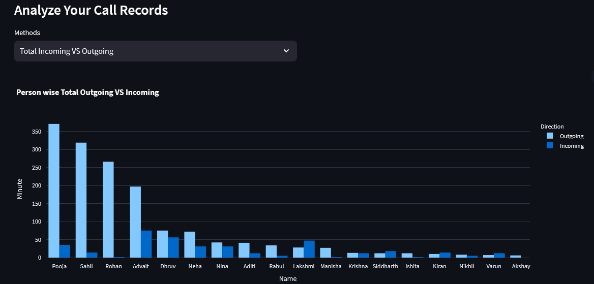

# Call Log Analysis

An interactive web dashboard built with Streamlit and Plotly that visualizes call log data, uncovering communication patterns and hidden insights from your phone records.

**[Live Demo](https://calllog.streamlit.app/)**

---

## Features

- **Incoming vs Outgoing Breakdown** -- Compare the total number and duration of incoming and outgoing calls per contact.
- **Total Call Duration** -- See how much time you spend on the phone with each person.
- **Average Talk-Time** -- Identify contacts with the longest (or shortest) average call length.
- **Missed Call Ranking** -- Find out who gives you the most missed calls.
- **Rejected Call Analysis** -- View calls rejected by you and calls of yours rejected by others.
- **Call Schedule Heatmap** -- Discover which hours of the day you are most active on the phone, split by direction.
- **Person-Wise Deep Dive** -- Select any contact to see a full statistical breakdown of your call history with them.

## Screenshots

### Total Incoming vs Outgoing



### Call Schedule


### Person-Wise Analysis


## Tech Stack

| Layer          | Technology              |
|----------------|-------------------------|
| Frontend / App | Streamlit               |
| Visualization  | Plotly Express          |
| Data Processing| pandas                  |
| Language       | Python 3.8+             |

## Run Locally

1. **Clone the repository**

   ```bash
   git clone https://github.com/Mazhar004/python-data-visualization.git
   cd python-data-visualization/Streamlit/CallLogAnalysis
   ```

2. **Install dependencies**

   ```bash
   pip install -r requirements.txt
   ```

3. **Start the app**

   ```bash
   streamlit run app.py
   ```

   The dashboard will open in your browser at `http://localhost:8501`.

## Project Structure

```
CallLogAnalysis/
├── app.py                  # Streamlit application entry point
├── requirements.txt        # Python dependencies
├── data/
│   └── Artifical_Call_Log_Data.csv   # Sample call log dataset
├── images/                 # Screenshot assets for documentation
├── notebook/
│   ├── Artificial Data Generate.ipynb  # Notebook to generate sample data
│   └── Call Log Analysis.ipynb         # Exploratory analysis notebook
└── utils/
    ├── __init__.py
    ├── figconfig.py        # Analysis method configurations
    ├── figview.py          # Chart generation functions
    ├── preprocessing.py    # Data loading and filtering helpers
    └── utils.py            # Aggregation and formatting utilities
```

## Data

The included dataset (`Artifical_Call_Log_Data.csv`) is artificially generated. Each record contains a contact name, phone address, call direction, call status, duration, and timestamp.
