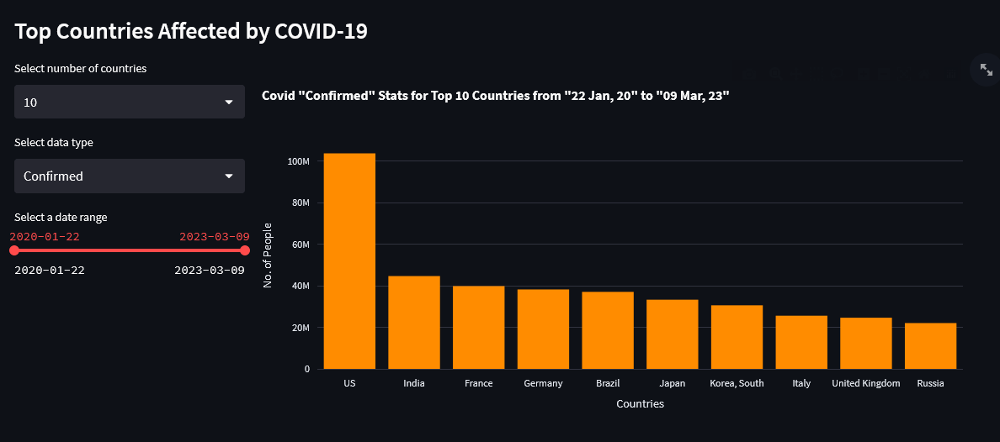
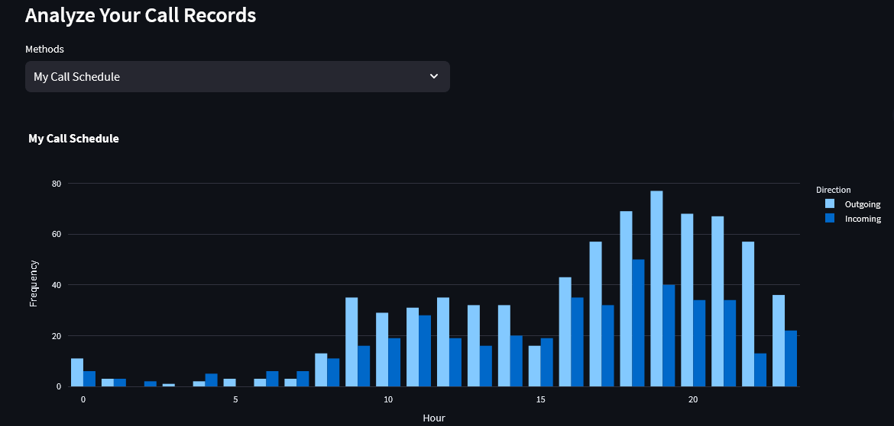
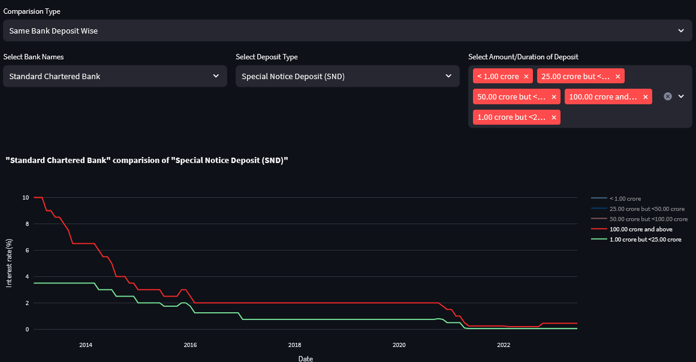

# Streamlit Web Applications

This section contains three interactive data visualization web applications built with Streamlit. Each app is deployed and accessible via a live demo link, providing browser-based exploration of different datasets through interactive Plotly charts.

---

## Applications

### 1. COVID-19 Data Analysis

An interactive dashboard for exploring global COVID-19 statistics. Compare confirmed cases, recoveries, and deaths across countries with line charts, and identify the most affected nations using ranked bar charts. Features dynamic date range filtering and configurable top-K country selection.

- **Source:** [CovidDataAnalysis/](CovidDataAnalysis/)
- **Live Demo:** [visualcovid.streamlit.app](https://visualcovid.streamlit.app/)




---

### 2. Call Log Analysis

Analyze call log data to uncover communication patterns. Breaks down incoming vs. outgoing call frequency and duration per contact, tracks missed and rejected calls, and visualizes hourly call activity. Supports per-person drill-down analysis.

- **Source:** [CallLogAnalysis/](CallLogAnalysis/)
- **Live Demo:** [calllog.streamlit.app](https://calllog.streamlit.app/)




---

### 3. Bangladesh Bank Deposit Rate Analysis

A visual comparison tool for interest rates across scheduled banks in Bangladesh. Compare deposit scheme rates bank-by-bank or scheme-by-scheme, using publicly available data from Bangladesh Bank.

- **Source:** [BangladeshBankDeposit/](BangladeshBankDeposit/)
- **Live Demo:** [bdbankanalysis.streamlit.app](https://bdbankanalysis.streamlit.app/)




---

## Common Tech Stack

All three applications share a consistent technology stack:

| Layer         | Technology       |
|---------------|------------------|
| Frontend / UI | Streamlit        |
| Charting      | Plotly           |
| Data Handling | Pandas           |
| Language      | Python 3.8+      |

The Bangladesh Bank Deposit app additionally uses `lxml` for web scraping of source data from the Bangladesh Bank website.

---

## Running Locally

Each app follows the same setup process:

1. **Navigate to the app directory**

   ```bash
   cd Streamlit/<AppName>
   ```

2. **Create a virtual environment (recommended)**

   ```bash
   python -m venv venv
   source venv/bin/activate   # On Windows: venv\Scripts\activate
   ```

3. **Install dependencies**

   ```bash
   pip install -r requirements.txt
   ```

4. **Start the app**

   ```bash
   streamlit run app.py
   ```

   The app will open in your default browser at `http://localhost:8501`.

---

## Project Structure

```
Streamlit/
├── CovidDataAnalysis/
│   ├── app.py
│   ├── covid_streamlit_view.py
│   ├── covid_fig.py
│   ├── utils.py
│   ├── requirements.txt
│   └── images/
├── CallLogAnalysis/
│   ├── app.py
│   ├── utils/
│   ├── data/
│   ├── notebook/
│   ├── requirements.txt
│   └── images/
├── BangladeshBankDeposit/
│   ├── app.py
│   ├── fig_generate.py
│   ├── data_scrap.py
│   ├── map_keys.py
│   ├── data/
│   ├── notebook/
│   ├── requirements.txt
│   └── images/
└── README.md
```
