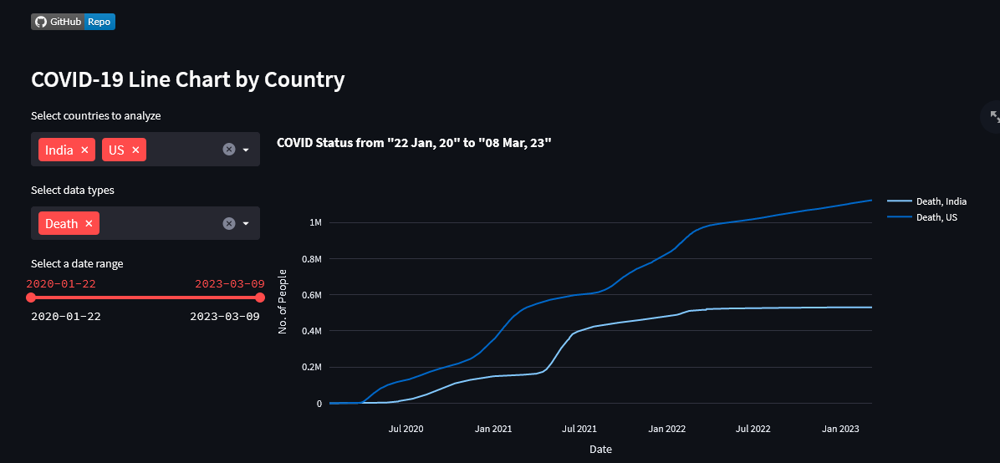
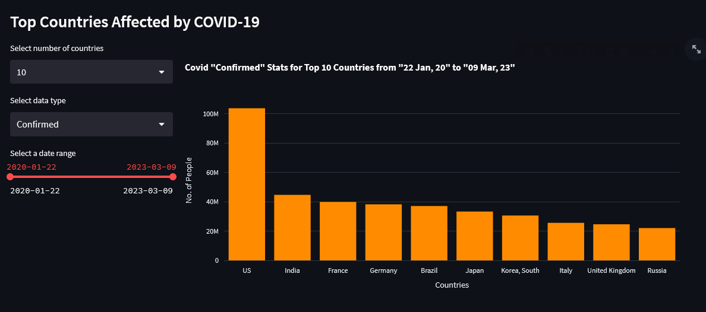

# Data visulization using Streamlit #

## Description: ##

Coronavirus rapidly spread out across the world.This is the visual representation of affected,recovered & death people in numbers.In this visulization data was represented by country & worldwide wise.

## Installation

### Python Version
- Python == 3.8

### Library Installation
- Library Install
  - `pip install -r requirements.txt`

### Streamlit App Run(Web View)
- `streamlit run app.py`

## Data collection ##

This data was collected from an online portal in real time. [Link](https://data.humdata.org/dataset/novel-coronavirus-2019-ncov-cases)

## Data visualize ##
* **Country Wise Comparisions:**
  
* **Worldwide Affected Statistics:**
  

### Better view available in [Corona Affected Country](../../Corona%20Affected%20Country/plotly/) ###